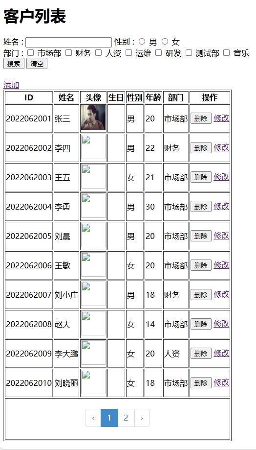

1. 网站运行目录配置到public目录下，设置nginx伪静态：

```plain
location / {
    try_files $uri $uri/ /index.php?$query_string;
}
```

2. mysql数据库文件放置在database/admin-test-yu.sql文件中，将该文件执行到数据库。默认的登录账号有admin 密码123456 和 test 密码123456。


3. 



tips:该网页面采用纯原生手写方式，未使用框架，所以在完整性方面有所缺失


